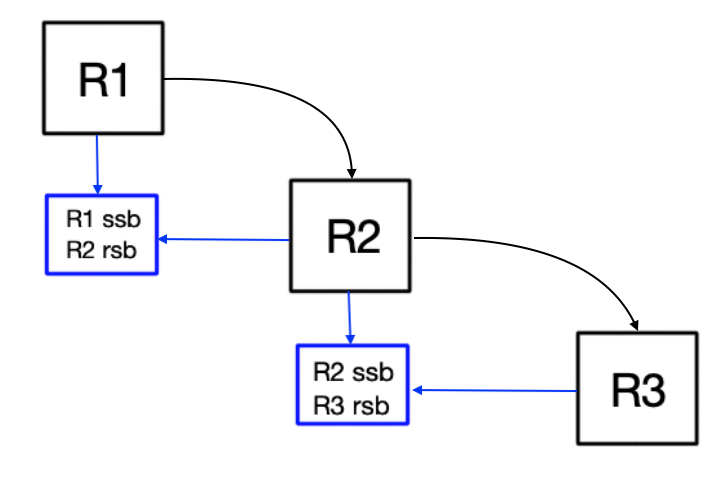

# CHVM Intermediate Language Compiler (CHIRC)

This document defines an IR which can be compiled to CHVM bytecode using the 
CHIRC.

## Notes on Memory 

The CHVM will have memory which is garbage collected. Pieces of 
data in this space will be known as *virtual*.

The CHVM will have memory which is not subject to garbage collection. Pieces
of data in this space will be known as *physical*.

## Types

This IR will have static typing. That is, types of all piece of data can be 
determined at compile time.

### Primitive Types

* `int` is a 64-bit signed integer.
* `flt` is a 64-bit floating point number.
* `chr` is an 8-bit unsigned character/byte value.

### Simple Composite Types

#### Static Arrays
A static array is a fixed sized list of values whose 
length can be determined at compile time.

```
[3]int      // static array of 3 integers.
[10]flt     // static array of 10 floats.

[3][3]int   // 3 x 3 static matrix of 9 integers.
```

#### Records
A record or `rec` is a sequence of named values. 

```
// A record whose values represent a 2D point.
rec {
    int x;
    int y;
}

// A record whose values represent a bank account.
rec {
    [8]chr id;      // 8 character id.
    int balance;    // account balance.
}
```

### Virtual Addresses
The types defined so far can all be used to create *physical* or *virtual* values.
That is, values of these types can exist anywhere.

This property is not held for all types though.

A value which resides in virtual memory is accessed via a *virtual address*. This is 
something which is provided by the garbage collector when the value is created.
If the user has access to a virtual address, the garbage collector must know. 
Otherwise, the garbage collector may delete the memory without realizing it is still
in use.

The garbage collector is only aware of the memory it manages. So, for the
garbage collector to be aware of a user's virtual address, the address must
reside in *virtual* memory.

So, if a type holds a virtual address, values of said type must reside in
virtual memory. 

A virtual address is denoted with the `@` character.

```
@int        // The virtual address of an int in the garbage collected space.
@[3]int     // The virtual address of static integer array.


// NOTE, the record below contains a virtual address. Thus, all values
// of this type must reside in virtual memory and be referenced via
// a virtual address.

rec {
    @[3]int v_val_array;    // Array of 3 arbitrary values stored in
                            // virtual memory.

    int x;      // an integer (x, y) point value.
    int y;
}
```

### Type Definitions

#### The `type` Keyword

The user can name types using the `type` keyword.

```
type floatMat [3][3]flt;    // floatMat is a placeholder for 
                            // a 3x3 float static matrix.

type IntBox @int;       

type point3D rec {
    int x;
    int y;
    int z;
};
```

__NOTE:__ in the above definitions `IntBox` starts with a capital `I`.
While not enforced by the compiler, when declaring a virtual address type, the name of the 
type should be capitalized.

#### Type Generics
CHIR supports simple generics in type definitions using the `<>` charcters.
```
type GenericMat<T> @[3][3]T;

type point3DFlt rec {
    flt x; flt y; flt z;
};

// A Matrix which holds points.
type MatPoint3DFlt GenericMat<@point3DFlt>;
```

A type can have more than one type parameters. 
To simplify the compiling of the bytecode, a given generic type must be 
a virtual address. For example, in the above code, the type parameter `T` cannot take value
`point3DFlt`, instead it is given a virtual address, `@point3DFlt`.

As a result of this property, a value created from a generic type must itself reside in
virtual memory.

The below type will compile fine. However, since a `simpleMapEntry` contains a virtual address field (`value`), any value of type `simpleMapEntry` must reside in virtual memory. Thus, in order to access such
a value, a virtual address of type `@simpleMapEntry` would have to be used.

```
type simpleMapEntry<T> rec {
    int key;
    T value;
};
```

It would make more sense to define the type itself as being a virtual address as we know
its values will reside in virtual memory.
```
type SimpleMapEntry<T> @rec {
    int key;
    T value;
};
```

### Dynamically Sized Array Types
As we will see, there is a way to create an array with a size determined
at runtime. The values held inside these arrays do not need to be virtual addresses.
They can be anything. However, dynamically sized arrays cannot be stored in physical memory
since their sizes are unknown at compile time.

Dynamic arrays must be stored in virtual memory, and thus must be accessed using a virtual
address. The dynamic array type is declared using the `@[]` prefix.

```
type Student @rec {
    // A dynamic array of characters can be used to represent a string of text.
    // In this case, a student's name.
    @[]chr name;

    // NOTE: this hypothetical bad_name field is not allowed.
    // 
    // The size of this record must be determinable at compile time.
    // If the value of a dynamic array were allowed on its own inside this 
    // record, the size of a student's record would depend on the length of 
    // their name.
    // 
//  []chr bad_name;

    int grade;
};
```

## Routines

All user CHIR code will reside in routines. These are modular chunks of code which themselves
can be called in user code.

### Routine Runtime Design
When a routine runs, memory is set aside for its execution. Some memory will be virtual and some will
be physical depending on how the routine is defined.

The memory of a routine is divided into *Stack Blocks*. 

A stack block contains a piece of memory which resides in the virtual space (referenced with `.v`).
A stack block also contains a piece of memory which resides in the physical space (referenced with
`.p`).

When a routine executes, its code always has access to at least 2 stack blocks.

The first stack block is known as the *Received Stack Block* or `rsb`. This block is created before
the routine is called. It contains parameters required to run the routine and also space for a return
value.

The second stack block is known as the *Internal Stack Block* or `isb`. This block is created 
when the routine is called. It contains memory only accessible by the routine code. The `isb` is
intended to hold local variables.

The third possible stack block accessible is known as the *Sending Stack Block* or `ssb`. It is *possible*
since it doesn't always exist. Inside a routine, it is only accessible when a subroutine is to be 
executed. When requested, the `ssb` of a routine will have the structure of the `rsb` of the subroutine.

Take a look at the abstract diagram below. This represents the execution of a routine *R1* which calls 
*R2* which calls *R3*.



Realize that the block *sent* by *R1* (`R1 ssb`) is the block which is *received* by *R2* (`R2 rsb`).
The same goes for `R2 ssb` and `R3 rsb`: they are the same.

### Defining a Routine

To define a routine, you provide the structure of the routine's `rsb` and `isb`.

If these definitions are omitted, they will be interpreted as empty. For example, if no `rsb` is 
defined, it will be assumed that the routine has no paramters or return values.

Routine definitions abide by the following structure.

```
routine myRoutine {
    // Received Stack Block (i.e. parameters and return value)

    rsb.V {     // Optional.
        // Values to be held in the virtual piece of memory referenced by
        // rsb.V.
    }

    rsb.p {     // Optional.
        // Values to be held in the physical piece of memory referenced by
        // rsb.p.
    }

    // Internal Stack Block (i.e. local variables)

    isb.V {     // Optional.
        // Values to be held in the virtual piece of memory referenced by
        // isb.V.
    }

    isb.p {     // Optional.
        // Values to be held in the physical piece of memory referenced by
        // isb.p.
    }

    // User Code Section.

    text {      // Required.
        // User Code.
    }
}
```

